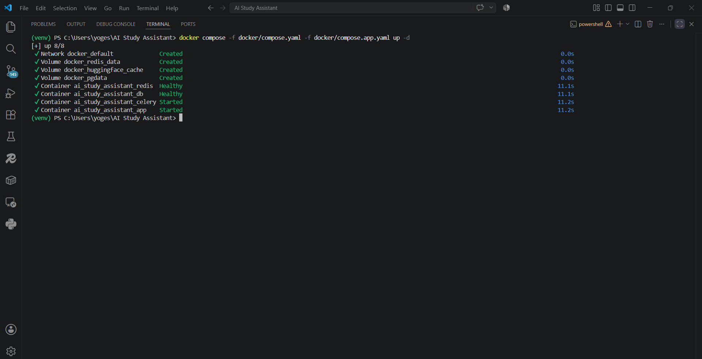
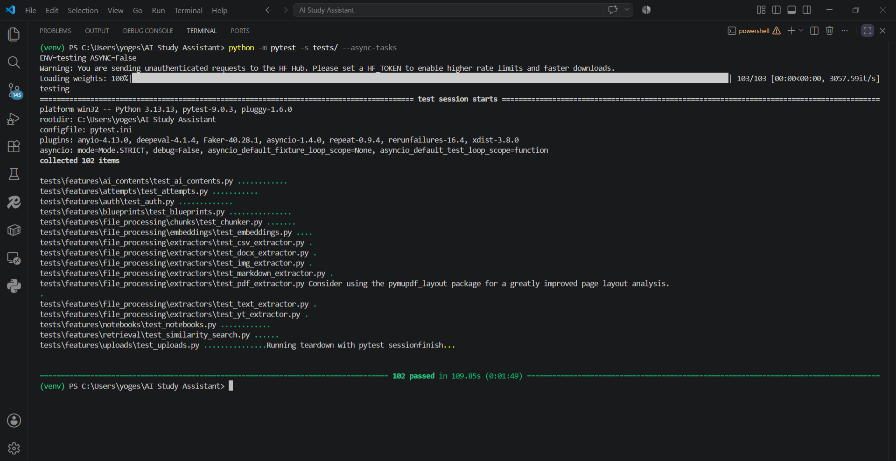
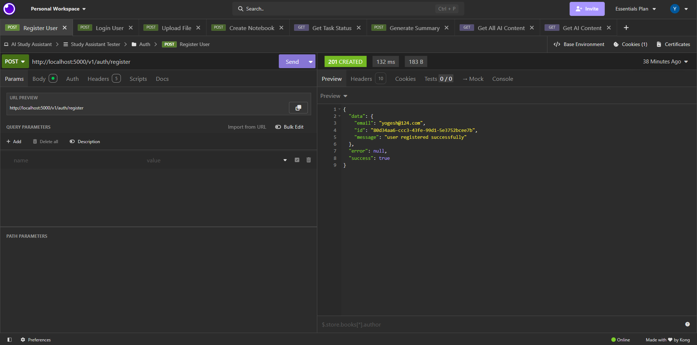
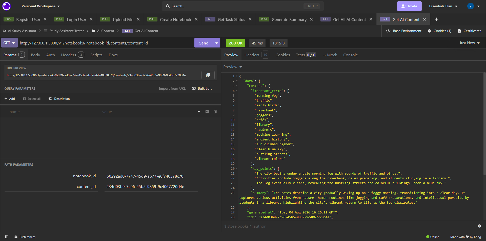

# Production-Oriented Configuration-Driven AI Study Assistant Backend

> A production-oriented, configuration-driven AI Study Assistant backend inspired by NotebookLM and extended with blueprint-driven exam generation.


---

## Overview

This project is a production-oriented AI Study Assistant backend built to apply modern backend engineering and AI engineering concepts in a single cohesive application.

Inspired by NotebookLM, the backend supports document ingestion, retrieval-augmented generation (RAG), AI-powered content generation, and asynchronous processing while introducing **blueprint-driven exam generation** as a key differentiating capability.

Rather than focusing solely on AI features, the project emphasizes maintainable architecture, modular design, configuration-driven development, automated testing, and production-oriented engineering practices.

---

## Project Highlights

- Feature-oriented modular monolith architecture
- Configuration-driven environment management
- JWT authentication using RSA key pairs
- PostgreSQL with pgvector for semantic retrieval
- Redis-backed asynchronous processing with Celery
- Retrieval-Augmented Generation (RAG)
- Blueprint-driven exam generation
- AI-powered summaries, quizzes, flashcards, mind maps, and exams
- Multiple document upload formats
- Comprehensive testing infrastructure
- Docker-based development workflow
- GitHub Actions continuous integration
- Architecture Decision Records (ADRs)
- Extensive architecture and development documentation

---

## Features

### Authentication

- User registration
- Login
- JWT authentication
- Refresh tokens
- Logout
- Protected endpoints

### Notebook Management

- Create notebooks
- Update notebooks
- Delete notebooks
- Upload learning resources

### File Processing

Supported upload formats include:

- PDF
- DOCX
- Markdown
- Text
- CSV
- Images (OCR)
- YouTube transcripts

### AI Features

Generate AI learning material including:

- Summaries
- Quizzes
- Flashcards
- Mind Maps
- Exams

Evaluate generated content through:

- Quiz evaluation
- Exam evaluation

### Retrieval

- Semantic search using embeddings
- Vector similarity search with pgvector
- Citation-aware context retrieval

### Background Processing

Long-running operations execute asynchronously using Celery.

Examples include:

- File processing
- Document chunking
- Embedding generation
- AI content generation
- Evaluation tasks

---

## 📸 Screenshots

### Docker Environment

The complete backend stack running with Docker Compose.



---

### Async Integration Tests

Asynchronous API tests executed successfully.



---

### Authentication API

Successful user registration using the REST API.



---

### AI Content Generation

Example AI-generated summary returned from the retrieval pipeline.



---

## Technology Stack

### Backend

- Python
- Flask
- SQLAlchemy
- Alembic

### Database

- PostgreSQL
- pgvector

### AI

- Google Gemini
- Hugging Face Transformers
- Sentence Transformers

### Infrastructure

- Redis
- Celery
- Docker

### Testing

- Pytest
- GitHub Actions

---

## Architecture

The backend follows a layered architecture.

```
Client
    │
    ▼
Routes
    │
    ▼
Services
    │
    ▼
Repositories
    │
    ▼
Database
```

Long-running workflows are executed asynchronously through Celery while sharing the same service layer used by synchronous requests.

---

## Project Structure

```
AI Study Assistant
├── app/                # Flask application factory
├── configs/            # Environment configuration
├── docker/             # Docker & Compose files
├── docs/               # Architecture and API documentation
├── models/             # SQLAlchemy models
├── repositories/       # Database layer
├── routes/             # REST API endpoints
├── services/           # Business logic
│   ├── ai/
│   ├── ai_generation/
│   ├── attempts/
│   ├── auth/
│   ├── chat/
│   ├── exams/
│   ├── file_processors/
│   ├── retrieval/
│   └── uploads/
├── tasks/              # Celery background tasks
├── tests/              # Integration & unit tests
├── rag_evaluation/     # RAG Evaluation module
├── validators/         # Pydantic schemas
└── README.md
```

See the [Project Structure](docs/development/ProjectStructure.md) documentation for a complete explanation of each directory.

---

## Getting Started

See the [Quick Start](QuickStart.md) guide for installation, configuration, Docker setup, database initialization, and first-time project setup.

---

## 📚 Documentation

The project includes comprehensive documentation covering architecture, deployment, development practices, APIs, and design decisions.

### Architecture

- Backend Architecture
- Authentication
- AI
- Retrieval
- Database
- Celery
- File Processing

### Development

- Project Structure
- Coding Style
- Testing

### Deployment

- Docker
- Environment Configuration

### API

- Authentication
- Notebooks
- Uploads
- AI Features
- Chat
- Blueprints
- Attempts

### Design Decisions

Architecture Decision Records (ADRs) document important technical decisions and deferred improvements made throughout the project.

---

## Continuous Integration

GitHub Actions automatically executes the test suite on every push and pull request.

The pipeline includes:

- Dependency installation
- Docker service startup
- PostgreSQL health checks
- Redis health checks
- Synchronous test execution
- Asynchronous Celery integration tests

---

## Evaluation

The repository includes a separate Retrieval-Augmented Generation (RAG) evaluation pipeline for measuring retrieval and generation quality independently from the application test suite.

See the [evaluation documentation](rag_evaluation/README.md) for setup and execution instructions.

---

## API Testing

If you want to test the API, you can use the provided **Insomnia collection**.

For instructions on importing the collection, configuring the required environment variables, authentication, and using the requests, see the [API Collection README](api_collection/README.md).

---

## Repository Status

> **Current Status:** Active

This repository is intended as a production-oriented learning project demonstrating backend engineering and AI engineering principles through practical implementation.

---

## Next Steps

To get started with the project, follow the [Quick Start](QuickStart.md) guide.

Additional documentation is available for deployment, architecture, APIs, and development practices.

---

## Screenshots / Demo

> **Placeholder**

- GIF demonstrating the API workflow
- Screenshots of request/response examples
- Architecture diagrams

---

## 🤝 Contributing

Contributions are welcome!

Before writing any code, please read:

- [Coding Standards](docs/development/CodingStandards.md)
- [Project Structure](docs/development/ProjectStructure.md)

These documents describe the project's architecture, coding conventions, and repository organization.

Please ensure that:
- New features follow the existing architecture (Repository → Service → Route).
- Tests are added or updated where appropriate.
- Documentation is updated when behavior changes.

---

## License

This project is licensed under the MIT License.

---

## Contact

**Yogesh Jaiswal**

- LinkedIn: **[https://www.linkedin.com/in/yogesh-jaiswal-08328b3a2/](https://www.linkedin.com/in/yogesh-jaiswal-08328b3a2/)**
- GitHub: **[https://github.com/Yogesh-jaiswal/](https://github.com/Yogesh-jaiswal/)**